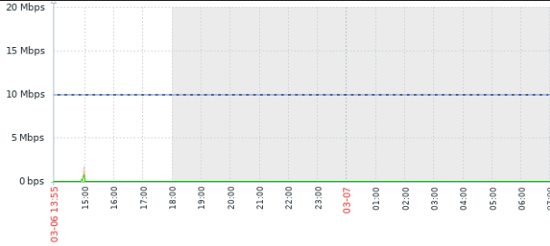

## Juniper-Zabbix-Policer 
Juniper-Zabbix-Policer is an automation script that is customized to monitor subinterfaces on a juniper routerers and 
create triggers using the configured policer speeds using Zabbix triggers.

The script uses PyZabbix to intereact with tha zabbix database and to create , update and delete triggers from zabbix , although there are some internal configurations in the zabbix server and the Web GUI so that the script starts functioning, also note that some router configurations may be relied to change.
So let's start by some standards.
Since the script is configured to match policers by policer names.

### For example
```
set firewall policer default if-exceeding bandwidth-limit 10m
set firewall policer default if-exceeding burst-size-limit 150k
set firewall policer default then discard
```
if you have a policer configured like this, we will modify it and convert the policer name to limit-```speed in megabits```
```
set firewall policer limit-10m if-exceeding bandwidth-limit 10m
set firewall policer limit-10m if-exceeding burst-size-limit 150k
set firewall policer limit-10m then discard
```
after adjusting all policer names

Now we can start working on Zabbix Web.
1. Create a host for the Juniper device and monitor it
    with SNMP community conifgured on the device.
2. Create a discovery rule on the Host created with SNMP agent type and SNMP OID of ```discovery[{#IFNAME},1.3.6.1.2.1.2.2.1.2,{#IFALIAS},1.3.6.1.2.1.31.1.1.1.18]``` ,
    this will discover all the subinterfaces and interfaces present on the juniper device
3. Create 2 Item prototypes for Inbound and Outbound traffic

## For Inbound:
```
Name:   {#IFNAME} - {#IFALIAS} - Inbound traffic
key:    1.3.6.1.4.1.2636.3.3.1.1.1.[{#IFNAME}]
OID:    1.3.6.1.4.1.2636.3.3.1.1.1.{#SNMPINDEX}
```
## For Outbound:
```
Name:   {#IFNAME} - {#IFALIAS} - Outbound traffic
Key:    1.3.6.1.4.1.2636.3.3.1.1.4.[{#IFNAME}]
OID:    1.3.6.1.4.1.2636.3.3.1.1.4.{#SNMPINDEX}
```

For more information about juniper MIB and OIDs go through this link https://apps.juniper.net/mib-explorer/navigate?software=Junos%20OS&release=23.4R1
<hr>
-  Create a autodiscovered graph to combine outbound and inbound for each subinterface.(optional)

- Note: it is important to put the Key as mentioned in the documentation to not face any errors.
<hr>
Now add auto_snmp.py and auto_add.py to zabbix server and modify the variables inside it as of comments 

after modifieing add a cronjob so that every 5 minutes the script updates the triggers
#### Cronjob to be configured
```
*/5 * * * * sudo /usr/bin/python3 /home/zabbix/scripts/auto_add.py
```
Now under monitoring the latest data for each subinterface a new trigger must be created with infomation severity level
## Latest Data


